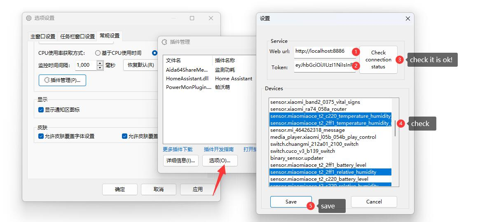

## [中文简体说明点我](README.zh_CN.md)
# Home Assistant TrafficMonitorPlugins
This is the Home Assistant plugin for [TrafficMonitor](https://github.com/zhongyang219/TrafficMonitor).

## plugin download

Please click the link below to go to the plugin download page:

[Home Assistant TrafficMonitor plugin download](https://github.com/daimiaopeng/home-assistant-TrafficMonitor/releases)

## plugin usage instructions

Select the corresponding version of the plugin according to the version of TrafficMonitor (x86 is 32-bit, x64 is 64-bit). After downloading and decompressing, you can get the dll file. After downloading, place the plugin dll in the `plugins` directory in the directory where the TrafficMonitor program is located:

After restarting TrafficMonitor, you can see all plugins in "Options" - "General Settings" - "plugin Management":

Initialize the settings, add the website address and token, and select the device data that needs to be monitored.

To display plugin items in the taskbar, right-click the taskbar window and select Display Settings.

At this time, the loaded plugin items will be displayed in "Display Settings" (if not, please restart the program), check the items you want to display on the taskbar, and click OK.

For more detailed instructions on using plugins, please refer to the following link:

[plugin function · zhongyang219/TrafficMonitor Wiki (github.com)](https://github.com/zhongyang219/TrafficMonitor/wiki/plugin function)

## Get Token
Open the Home Assistant main page

