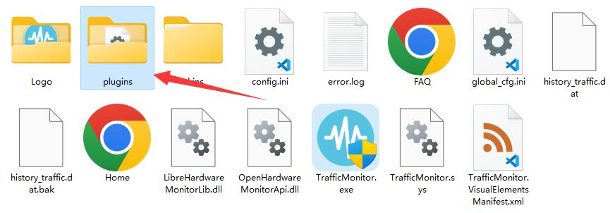

## [中文介绍](#cn)

# Home Assistant TrafficMonitorPlugins
This is the Home Assistant plugin for [TrafficMonitor](https://github.com/zhongyang219/TrafficMonitor).

## plugin download

Please click the link below to go to the plugin download page:

[Home Assistant TrafficMonitor plugin download](https://github.com/daimiaopeng/home-assistant-TrafficMonitor/releases)

## plugin usage instructions

Select the corresponding version of the plugin according to the version of TrafficMonitor (x86 is 32-bit, x64 is 64-bit). After downloading and decompressing, you can get the dll file. After downloading, place the plugin dll in the `plugins` directory in the directory where the TrafficMonitor program is located:

After restarting TrafficMonitor, you can see all plugins in "Options" - "General Settings" - "plugin Management":

Initialize the settings, add the website address and token, and select the device data that needs to be monitored.

To display plugin items in the taskbar, right-click the taskbar window and select Display Settings.

At this time, the loaded plugin items will be displayed in "Display Settings" (if not, please restart the program), check the items you want to display on the taskbar, and click OK.

For more detailed instructions on using plugins, please refer to the following link:

[plugin function · zhongyang219/TrafficMonitor Wiki (github.com)](https://github.com/zhongyang219/TrafficMonitor/wiki/插件功能)

## Get Token
Open the Home Assistant main page

# Home Assistant TrafficMonitorPlugins

这是用于[TrafficMonitor](https://github.com/zhongyang219/TrafficMonitor)的Home Assistant插件。

## 插件下载

请点击以下链接转到插件下载页面：

[Home Assistant TrafficMonitor 插件下载](https://github.com/daimiaopeng/home-assistant-TrafficMonitor/releases)

## 插件使用说明

根据TrafficMonitor的版本（x86为32位，x64为64位）选择对应版本的插件，下载后解压可得到dll文件，下载后将插件dll放到TrafficMonitor程序所在目录下的 `plugins`目录下：

重新启动TrafficMonitor后可以在“选项”——“常规设置”——“插件管理”中看到所有的插件：

初始化设置添加网站地址和token，选择需要监听的的设备数据

要使插件项目显示到任务栏中，请在任务栏窗口上点击鼠标右键，选择“显示设置”。

此时，“显示设置”中会显示已加载的插件项目(如果没有的话请重启一下程序)，勾选你希望显示在任务栏上的项目，点击确定即可。

关于更多插件使用的详细说明，请参考以下链接：

[插件功能 · zhongyang219/TrafficMonitor Wiki (github.com)](https://github.com/zhongyang219/TrafficMonitor/wiki/插件功能)

## 获取Token

打开Home Assistant主页面

